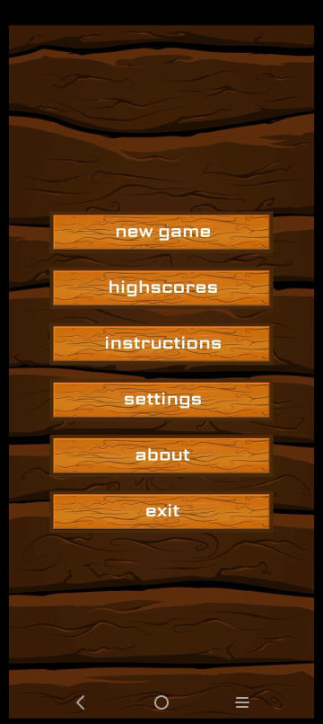
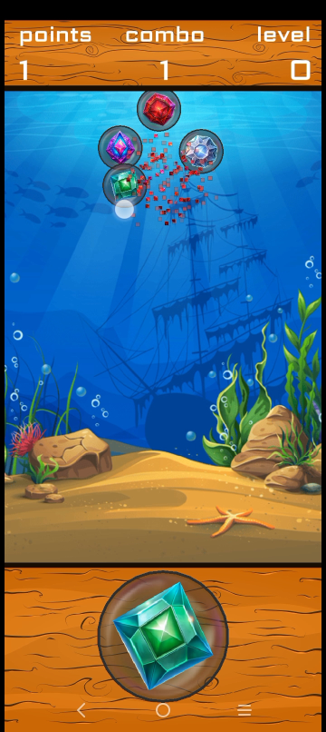
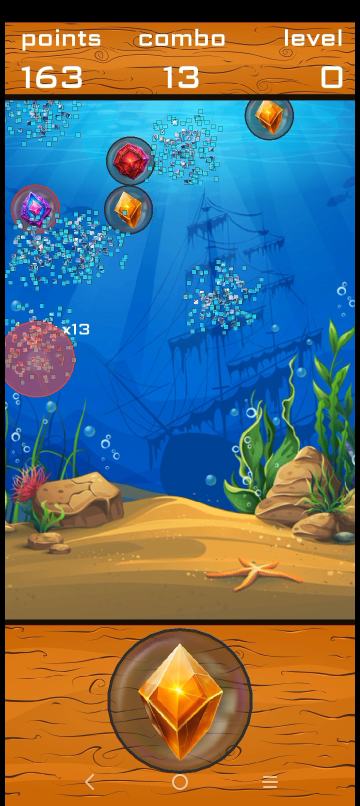

# Mystic Gems

## Spis treści
- [Opis](#opis)
- [Zrzuty ekranu](#zrzuty-ekranu)
- [Instalacja](#instalacja)
- [Technologie](#technologie)
- [Licencja](#licencja)

## Opis
**Mystic Gems** to prosta gra, w której trzeba klikać diamenty i nie pozwolić im spaść. 

## Zrzuty ekranu

## Instalacja
1. Pobierz i zainstaluj apk cxxdroid na smartphonie https://play.google.com/store/apps/details?id=ru.iiec.cxxdroid&hl=en-US&pli=1
2. Przenieś folder z grą do lokalizacji pamięć_wewnętrzna/Documents/Cxxdroid/Mystic-Gems
3. Uruchom cxxdroid
4. Otwórz plik pamięć_wewnętrzna/Documents/Cxxdroid/Mystic-Gems/src/main.cpp
5. Kompiluj i uruchom

## Technologie
Program stworzono w języku C++ z wykorzystaniem biblioteki SFML 2.5.1 w aplikacji cxxdroid.  
  
## Licencja
Licencja Otwarta – Uznanie autorstwa  
  
Ten program może być:  
-Pobierany  
-Kopiowany  
-Modyfikowany  
-Wykorzystywany w projektach prywatnych i komercyjnych  
  
Pod warunkiem, że:  
-Zachowana zostanie informacja o autorze oryginalnego programu  
-Podane zostanie źródło (link do repozytorium)  
-W przypadku modyfikacji, należy wyraźnie zaznaczyć, że program został zmodyfikowany oraz przez kogo.  